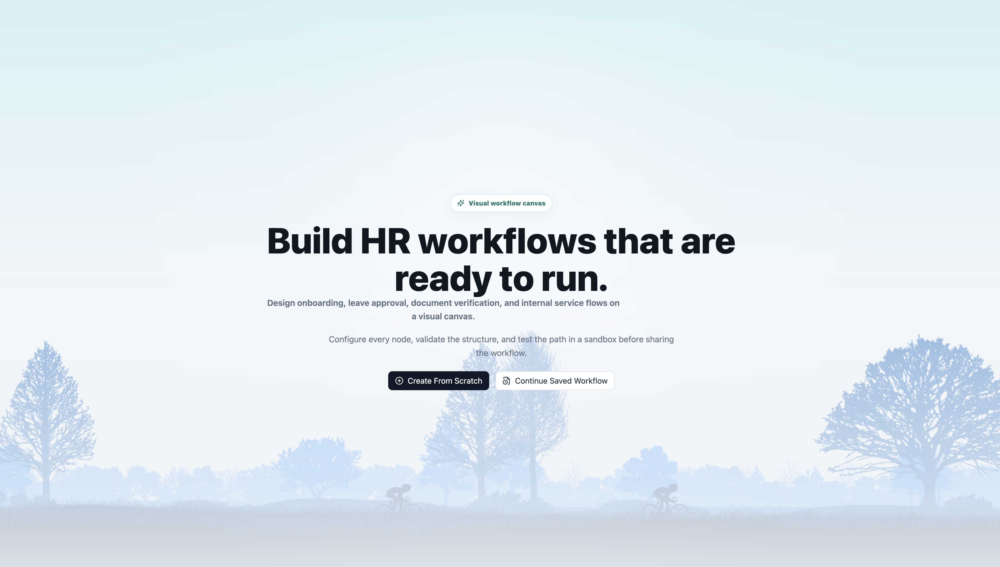
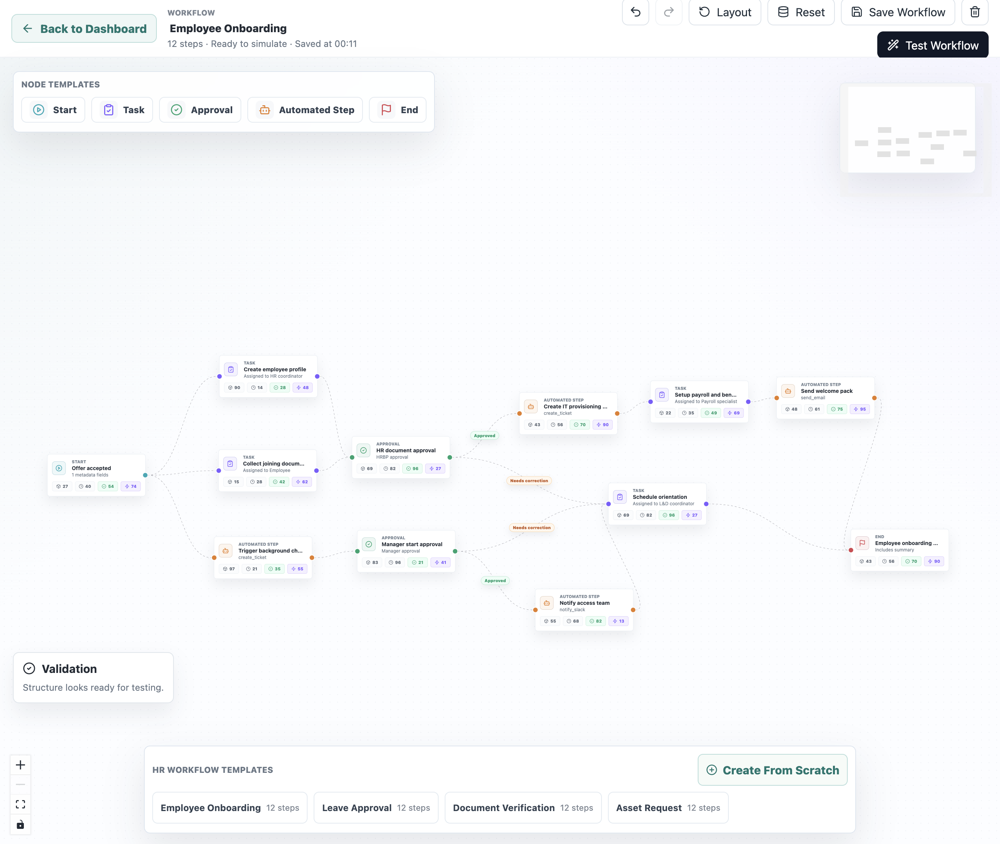
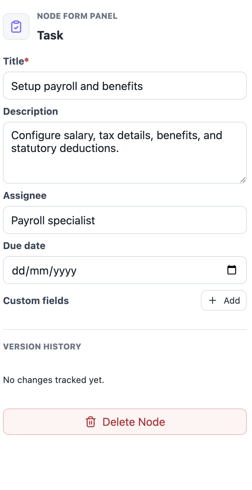
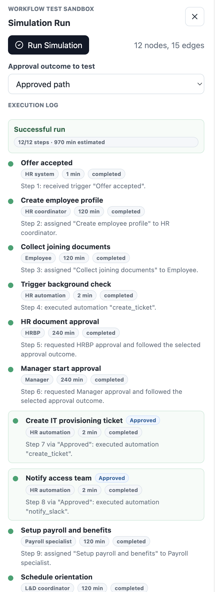

# HR Workflow Designer

This is a small web app where an HR admin can build a workflow by dragging boxes onto a canvas and connecting them with lines.

Think of it like making a flowchart:

```text
Start -> Collect Documents -> Manager Approval -> Send Email -> End
```

The app is built with **React**, **TypeScript**, **Vite**, and **React Flow**.

## Screenshots

Add screenshots to `docs/screenshots/` before submitting.

### Dashboard


### Workflow Canvas


### Node Configuration


### Simulation Sandbox


## What You Can Do

- Drag workflow steps from the left sidebar onto the canvas.
- Connect steps with arrows.
- Click a step to edit its details on the right side.
- Test the workflow in the sandbox panel.
- See validation errors if the workflow is broken.
- Export the workflow as JSON.
- Import a saved workflow JSON file.
- Load ready-made HR workflow templates.
- Add labels to connection lines, like `Approved`, `Rejected`, and `Needs correction`.
- Save the workflow in the browser after refresh.
- See a clear autosave indicator in the header.
- Click validation errors to jump to the broken node.
- Choose approval outcomes in the simulation sandbox.
- See simple version history for node edits.
- Use undo, redo, zoom controls, mini-map, and auto-layout.

## Node Types

The app has 5 kinds of workflow steps:

| Node | What It Means |
| --- | --- |
| Start | Where the workflow begins |
| Task | A human task, like collecting documents |
| Approval | Someone approves something, like a manager |
| Automated Step | The system does something, like sending an email |
| End | Where the workflow finishes |

## How To Run This Project

First, make sure Node.js is installed on your computer.

Then open this folder in a terminal and run:

```bash
npm install
```

This downloads the project packages.

After that, run:

```bash
npm run dev
```

You will see a local website link, usually:

```text
http://127.0.0.1:5173/
```

Open that link in your browser.

## How To Build The Project

To check that the project is ready for production, run:

```bash
npm run build
```

If it finishes without errors, the project builds correctly.

## How To Run Tests

To run validation tests, use:

```bash
npm run test
```

The tests check the important workflow rules, like missing Start nodes, missing End nodes, a Start node that is not first, broken connections, cycles, and required fields.

## How To Use The App

1. Choose a workflow from the dashboard.
2. Choose `Create From Scratch` for an empty canvas, or pick a ready-made template.
3. Look at the left sidebar.
4. Choose another ready-made template, or click/drag a node like `Task` onto the canvas.
5. Connect nodes by dragging from one small dot to another small dot.
6. Click any node to open its edit form.
7. Click any connection line to edit its label.
8. Click any validation error to jump to the broken node.
9. Change the title, assignee, approval role, automation action, or other fields.
10. Click `Test Workflow` to open the sandbox.
11. Pick an approval outcome and run the simulation to see the workflow step-by-step.

## Ready-Made Templates

The app includes one blank workflow option plus these larger HR templates. Each ready-made template has about 12 connected steps, with tasks, approvals, automation, and branching paths:

- Create From Scratch, which opens an empty canvas where users can click or drag every node type, connect them, configure forms, and export the final workflow as JSON.
- Employee onboarding
- Leave approval
- Document verification
- Asset request

## What The Sandbox Does

The sandbox checks the workflow and then pretends to run it.

It shows:

- The full `POST /simulate` request payload.
- Validation problems, if something is missing.
- A step-by-step execution log if the workflow is valid.
- Time taken for each step.
- Who owns each step.
- Success or waiting status.
- The conditional path used, like `Approved`.
- A selector for testing `Approved`, `Rejected`, or `Needs correction` paths.
- A final summary with total steps and total estimated time.

Example problems it can catch:

- There is no Start node.
- There is no End node.
- A node is not connected.
- The workflow has a cycle.
- A required Task title is missing.

## Folder Guide

Here is what the main folders mean:

```text
src/
  api/          fake API calls live here
  components/   React UI pieces live here
  data/         starter workflow and node templates live here
  hooks/        reusable React logic lives here
  types/        TypeScript types live here
  utils/        validation logic lives here
```

## Architecture Notes

- Canvas orchestration lives in `src/App.tsx`, where React Flow node changes, edge changes, drops, selection, and layout actions are coordinated.
- Node definitions and defaults live in `src/data/nodeTemplates.ts`, while larger reusable HR flows live in `src/data/workflowTemplates.ts`.
- Node rendering is isolated in `src/components/WorkflowNodeCard.tsx`, and node editing is isolated in `src/components/NodeFormPanel.tsx`.
- API behavior is isolated in `src/api/mockWorkflowApi.ts`, with endpoint-style contracts for `GET /automations` and `POST /simulate`.
- Reusable hooks keep async workflow state out of leaf components: `useAutomations` loads mock action definitions, and `useWorkflowSimulation` owns simulation request state.
- Workflow node, edge, API request, and simulation response interfaces live in `src/types/workflow.ts` so new node types can be added from one clear type boundary.

## Important Files

| File | What It Does |
| --- | --- |
| `src/App.tsx` | Main app logic and React Flow canvas |
| `src/components/NodeFormPanel.tsx` | The form shown when you click a node |
| `src/components/EdgeFormPanel.tsx` | The form shown when you click a connection line |
| `src/components/WorkflowNodeCard.tsx` | The custom node design on the canvas |
| `src/components/WorkflowDashboard.tsx` | The workflow list screen shown before the editor |
| `src/components/SimplePage.tsx` | Placeholder pages for sidebar modules |
| `src/api/mockWorkflowApi.ts` | Fake API for automations and simulation |
| `src/hooks/useAutomations.ts` | Loads available automation definitions from the mock API |
| `src/hooks/useWorkflowSimulation.ts` | Owns simulation API state and run/reset behavior |
| `src/utils/validation.ts` | Checks if the workflow is valid |
| `src/data/nodeTemplates.ts` | Defines the available node templates |
| `src/data/workflowTemplates.ts` | Defines ready-made HR workflow templates |
| `src/types/workflow.ts` | TypeScript shapes for nodes, edges, and API data |

## Mock API

There is no real backend server. The app uses fake API functions so the prototype works by itself.

The fake API lives in `src/api/mockWorkflowApi.ts` and exposes endpoint-style contracts for:

```text
GET /automations
```

This gives automation options like:

```json
[
  { "id": "send_email", "label": "Send Email", "params": ["to", "subject"] },
  { "id": "generate_doc", "label": "Generate Document", "params": ["template", "recipient"] }
]
```

And:

```text
POST /simulate
```

This accepts the workflow JSON and returns a fake step-by-step execution result with a run id, validation errors, execution steps, skipped approval branches, and a summary.

## Design Choices

- React Flow is used because it is good for draggable node-based editors.
- TypeScript is used so node data is easier to understand and safer to change.
- Node forms are separate from canvas nodes so the code stays clean.
- The mock API is local because this prototype does not need a backend.
- Validation is kept in one file so workflow rules are easy to find.
- Browser storage is used so the workflow stays available after refresh.
- Edge labels make approval flows feel more like real HR processes.

## Personal Design Decisions

I kept the first screen focused on workflow selection instead of making a marketing landing page. From there, the reviewer can immediately open a saved workflow, start from scratch, or load a complete HR template.

I added a sample onboarding workflow by default. An empty canvas can feel confusing at first, so the sample workflow helps show how Start, Task, Approval, Automation, and End nodes are supposed to work together.

I used a right-side edit panel because it keeps the canvas visible while changing node details. This makes it easier to understand how one small form change affects the workflow.

I kept the mock API simple and local. A real backend would take more time, and the main goal here is to show the front-end workflow logic clearly.

I also added validation messages on the canvas because mistakes are easier to fix when they are shown near the actual workflow, not only inside a hidden test result.

## What I Would Improve Next

If I had more time, I would improve these parts:

- Expand the sidebar pages into full modules. Right now Compliance, Scheduler, Analytics, Integrations, Repository, Workflows, Members, Inbox, Messages, Settings, and Help are intentionally lightweight future modules. In the future I would add real tables, filters, actions, and connected data for each one.
- Add better auto-layout for large workflows.
- Add deeper node version history with rollback.
- Add a real backend for shared workflow storage.
- Add role-based permissions.
- Add more advanced conditional branching rules.

## Completed vs Future Work

Completed in this prototype:

- React Flow canvas with custom Start, Task, Approval, Automated Step, and End nodes.
- Drag-and-drop node creation, edge connections, node/edge selection, deletion, mini-map, zoom controls, and auto-layout.
- Node configuration forms with controlled inputs, required fields, dynamic automation parameters, key-value editors, and node version history.
- Mock API layer for `GET /automations` and `POST /simulate`.
- Workflow sandbox that serializes the graph, validates structure, sends the payload to the mock simulation API, and displays a step-by-step execution log.
- Workflow validation for missing Start or End nodes, disconnected nodes, invalid Start placement, cycles, missing task titles, and missing automation actions.
- JSON import/export, browser autosave, ready-made HR workflow templates, and validation errors shown directly on nodes.

Future work with more time:

- Replace browser-only persistence with a real backend and shared workflow storage.
- Add permissions for HR admins, approvers, and workflow viewers.
- Support richer conditional logic, parallel branches, retry rules, and escalation timers.
- Add collaboration features such as comments, approvals, and publish/version states.
- Expand the lightweight sidebar modules into real HR operations screens.

## Project Status

This is a working prototype for the HR Workflow Designer case study.

It is ready to run locally, review, and publish on GitHub.
